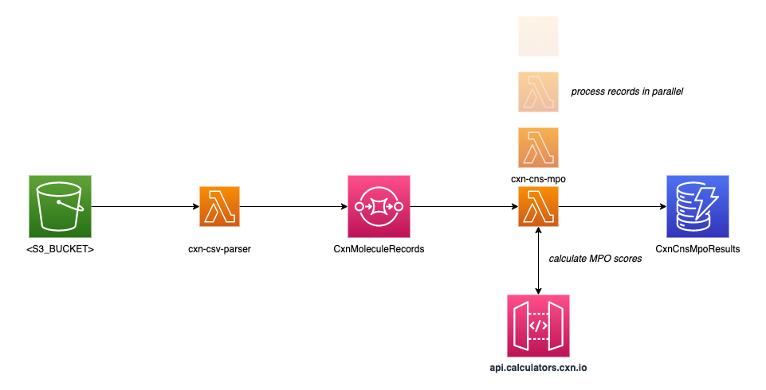

# Calculators on AWS Marketplace - Workflow example

This repository is a **proof of concept** demonstrating how a simple workflow can be built using [Calculators on AWS Marketplace](https://docs.chemaxon.com/display/lts-lithium/calculators-aws-marketplace.md). The workflow contains the following steps:
- parsing molecular structures from an S3 bucket and sending them to an SQS
- calculating [CNS-MPO scores](https://docs.chemaxon.com/display/docs/cns-mpo-score.md) with Calculators on AWS Marketplace
- storing the calculated results in a DynamoDB table
- filtering molecules based on their CNS-MPO scores (test)

If you have any questions or suggestions,  please feel free to contact us at
[`calculators-support@chemaxon.com`](mailto:calculators-support@chemaxon.com)

## Architecture diagram


## Prerequisites

- Create an [AWS account](https://aws.amazon.com/) if you do not have one yet.
- Subscribe to the [Calculators on AWS Marketplace](https://aws.amazon.com/marketplace/pp/prodview-bpnrwlvx2cys4) service and store your API key. [Step-by-step guide](https://docs.chemaxon.com/display/lts-lithium/calculators-aws-marketplace-getting-started.md).
- Install [AWS CLI](https://aws.amazon.com/cli/). The `aws configure` command is the fastest way to set up your AWS CLI installation. See this [quickstart guide](https://docs.aws.amazon.com/cli/latest/userguide/cli-configure-quickstart.html#cli-configure-quickstart-config).
- Install [NodeJS](https://nodejs.org/en/download/package-manager/).

## AWS resources

The project uses only some basic AWS resources (**S3**, **SQS**, **Lambda** and **DynamoDB**). If you want to know more about them,  please visit the related [AWS documentation](https://docs.aws.amazon.com/) pages.

All resources and their configurations can be deployed with the following commands:
````
npm install
npm run cdk deploy -- --parameters cxnApiKey=<API_KEY> --parameters bucketName=<BUCKET_NAME>
````

## Cost of calculations
- Subscribing to the service is **free of charge**. The cost is based on the number of calculation units consumed. Please check the [Pricing](https://docs.chemaxon.com/display/lts-lithium/calculators-aws-marketplace-pricing.md) page for further details.
- The price of the CNS-MPO calculation is **7 units/structure** so the below test run on 100 structures costs **7 USD**.
- There is some minimal cost of using the AWS resources ([AWS Pricing documentation](https://aws.amazon.com/pricing/)).

**We recommend to delete the created resources after the test run finished: `npm run cdk destroy`**

## Test
**!! Please be careful and do not upload more than 100 structures for testing purposes to prevent an unexpected cost. !!**

The following commands download molecular structures in SMILES format and upload the first **100 structures** to the created S3 bucket:
````
wget https://mcule.s3.amazonaws.com/database/mcule_ultimate_express1_220828.smi.gz
gzcat mcule_ultimate_express1_220828.smi.gz | head -n 100 >molecules.smiles
aws s3 cp molecules.smiles s3://<BUCKET_NAME>/
````

A Lambda function is triggered by the S3 upload event, parses the CSV records and sends them to an SQS.<br>
The records from the SQS are processed automatically. The CNS-MPO scores of the molecules are calculated and stored by another Lambda function.<br>
Finally, the molecules can be searched based on the CNS MPO score:
````
aws dynamodb scan \
    --table-name CxnResults \
    --filter-expression "cns_mpo_score > :s" \
    --expression-attribute-values '{ ":s": {"N": "5.75"} }' \
    --projection-expression "mol,cns_mpo_score"
````
